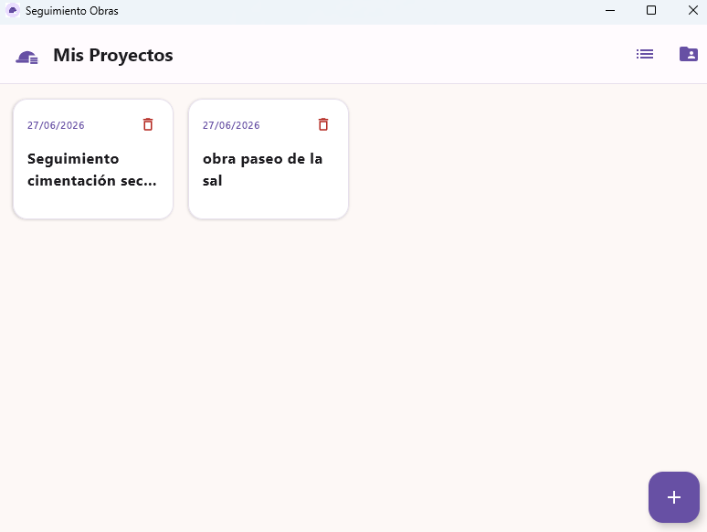
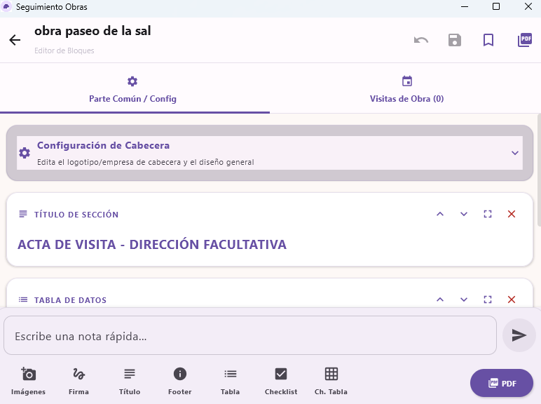
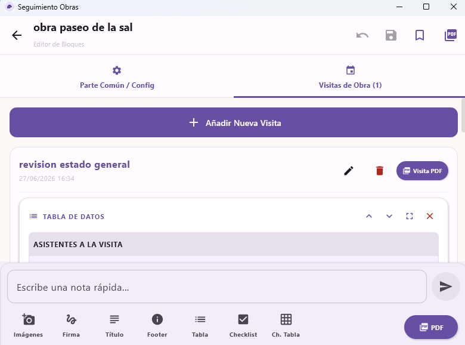
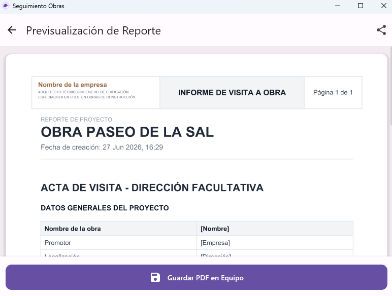

# PdfGenerator KMP

Aplicación multiplataforma (Android/Windows) para la gestión de visitas a obra y generación de informes técnicos profesionales en PDF de alta fidelidad.

## 🚀 Características Implementadas

*   **Gestión Multi-Proyecto**: Creación y persistencia local de proyectos de construcción con metadatos personalizados (empresa, cargo, título del informe).
*   **Sistema de Visitas**: Registro cronológico de visitas por proyecto, incluyendo notas de reunión e incidencias.
*   **Editor de Bloques Dinámico**: Sistema de construcción de informes mediante bloques modulares con formularios visuales:
    *   **Texto**: Campos de texto libre con soporte multi-línea.
    *   **Títulos y Pies de página**: Estructuración visual de secciones.
    *   **Imágenes**: Captura/selección de fotografías con opción de visualización a media anchura.
    *   **Firmas Digitales**: Panel interactivo (Skia en Desktop / Native Canvas en Android) para captura de firmas con etiquetas personalizables.
    *   **Tablas de Datos**: Editor visual interactivo de tablas con filas y columnas dinámicas.
    *   **Checklists**: Listas de tareas con estado de completado.
    *   **Tablas de Chequeo (Checklist Table)**: Tablas de inspección multi-columna (ej. SI/NO/NP) con recuadros de 8.5pt y centrado absoluto.
*   **Generación de PDF de Alta Fidelidad**:
    *   Motor de maquetación unificado (`PdfLayoutEngine`) en `commonMain` para garantizar paridad visual absoluta.
    *   Adaptadores de renderizado nativo: `android.graphics.pdf` en Android y `OpenPDF` en Windows.
    *   Incluye numeración de páginas, cabeceras corporativas encuadradas y estilos técnicos profesionales (negro sobre blanco).
*   **Gestión de Archivos**: Sistema de acceso a archivos y carpetas completamente centralizado en `commonMain` usando `WorkspaceManager` y `WorkspaceAccessor`.


## 🛠️ Stack Tecnológico y Arquitectura

### Arquitectura
El proyecto sigue una arquitectura **MVVM (Model-View-ViewModel)** dentro de un entorno **Kotlin Multiplatform (KMP)**.
*   **UI Compartida**: Implementada en `commonMain` usando **Compose Multiplatform**.
*   **Lógica de Datos**: Repositorios centralizados con flujos de datos reactivos (`Kotlin Flows`).
*   **Implementaciones Nativas**: Lógica específica en `androidMain` y `desktopMain` para renderizado de PDF y gestión de archivos.

### Tecnologías Principales
| Categoría | Tecnología/Librería |
| :--- | :--- |
| **Lenguaje** | Kotlin 2.1.0 |
| **Framework UI** | Compose Multiplatform 1.7.1 |
| **Almacenamiento** | Archivos JSON locales (JsonProjectStore) |
| **Serialización** | Moshi (JSON estructurado para bloques y proyectos) |
| **Imagen** | Coil 3.0.0-alpha |
| **PDF (Windows)** | OpenPDF (com.github.librepdf:openpdf) |
| **PDF Preview** | PDFBox (org.apache.pdfbox:pdfbox) |
| **DI** | Koin 4.0.0 |

## 📦 Requisitos y Configuración

### Requisitos Mínimos
*   **Android**: SDK 24 (Android 7.0) o superior.
*   **Desktop**: Java Runtime Environment (JRE) 17 o 21.
*   **Entorno de Desarrollo**: Android Studio Meerkat (2026.1.1) o IntelliJ IDEA.

### Configuración y Compilación
1.  **Clonar el repositorio**:
    ```bash
    git clone https://github.com/jufeza-boop/PdfGenerator.git
    ```
2.  **Sincronizar Gradle**: Se descargarán todas las dependencias multiplataforma necesarias.
3.  **Ejecutar en Android**:
    ```bash
    ./gradlew :composeApp:assembleDebug
    ```
4.  **Ejecutar en Windows**:
    ```bash
    ./gradlew :composeApp:run
    ```
5.  **Generar Instalador Windows (MSI)**:
    ```bash
    ./gradlew :composeApp:packageMsi
    ```

## 📸 Capturas de Pantalla





